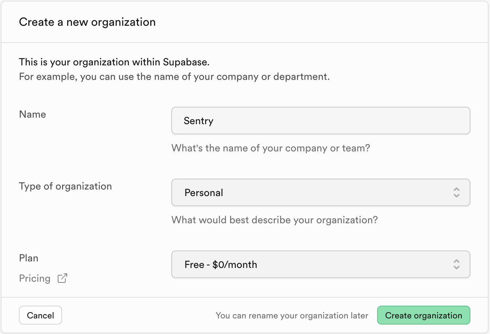
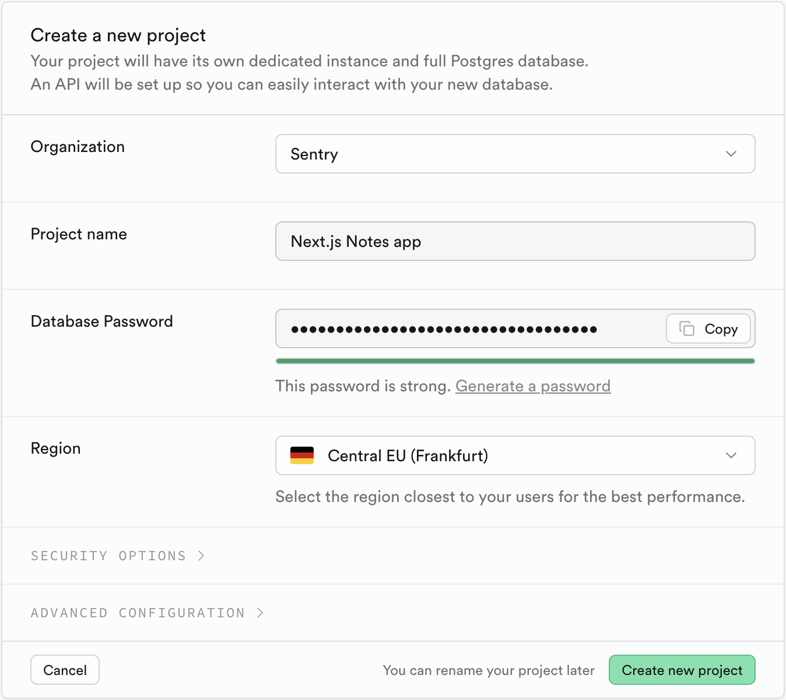
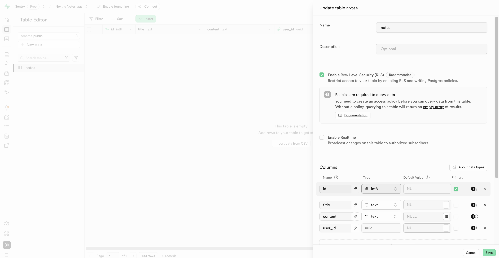
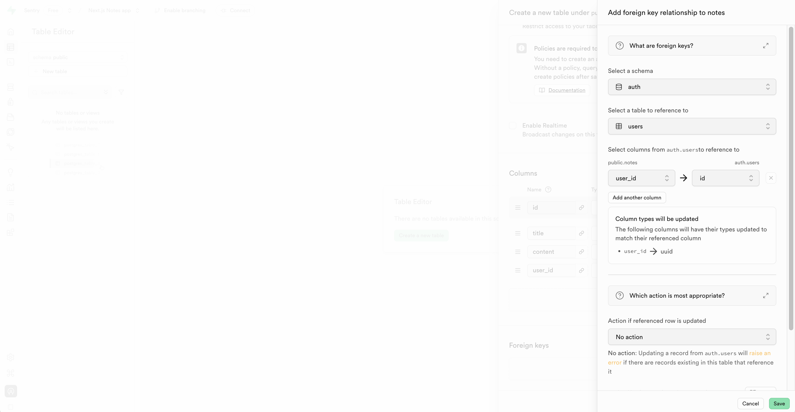
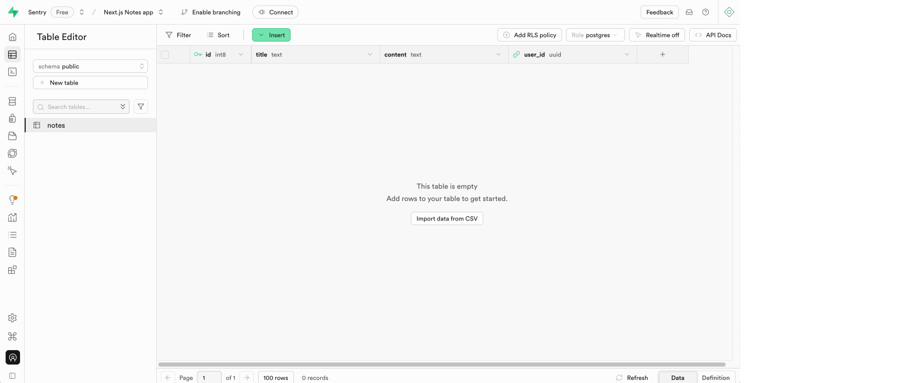
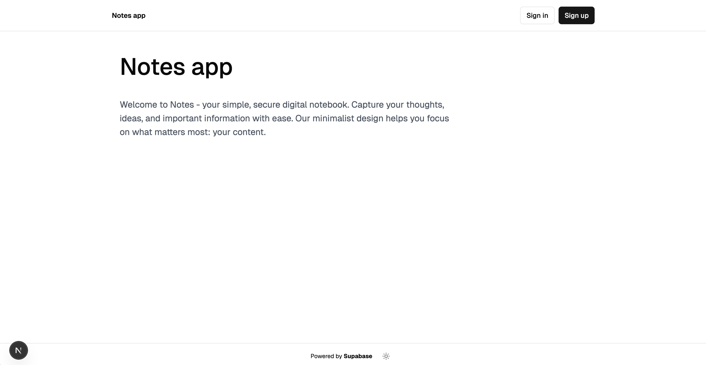
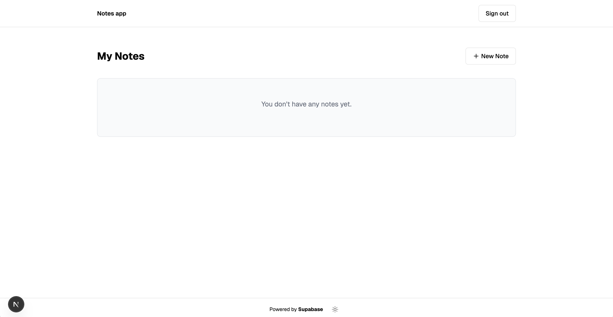
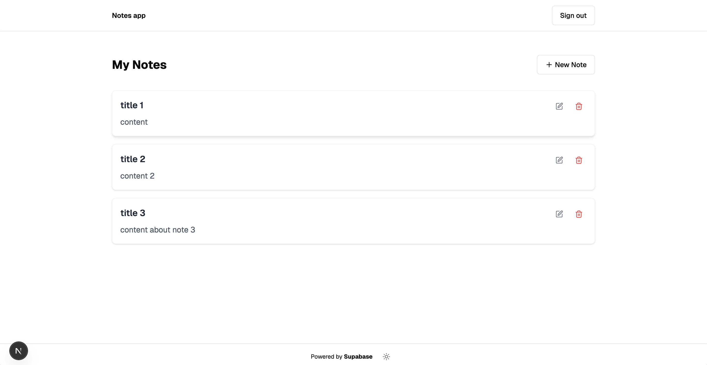

# Note taking app

A basic Next.js application for creating notes. Built with TypeScript and Supabase.

## Features

- User authentication (sign up, sign in)
- Notes creation
- Supabase PostgreSQL database
- Light mode and dark mode
- Styling with [Tailwind CSS](https://tailwindcss.com)
- Components with [shadcn/ui](https://ui.shadcn.com/)

## Installing the dependencies

Install the dependencies using the following command:

```bash
npm install
```

## Setting up a Supabase database

[Sign up to Supabase](https://supabase.com/dashboard/sign-up), if you don't already have an account. Create an organization:



Create a new project:




Open the **Table Editor** page from the navigation on the left and click the "+ New Table" button. Create a table called `notes` with the following columns:

| Name    | Type | Default Value | Primary | Is Identity |
| ------- | ---- | ------------- | ------- | ----------- |
| id      | int8 | null          | true    | true        |
| title   | text | null          | false   |             |
| content | text | null          | false   |             |
| user_id | uuid | null          | false   |             |



Click the "Add foreign key relation" button at the bottom of the form. Select the **users** table in the Supabase **Auth** schema to reference to. Create a one-to-one relationship between `notes.user_id` and `auth.users.id` and then click the "Save" button:



You'll see an empty table:



Open the **SQL Editor** page from the navigation menu on the left and add the following SQL queries to the editor:

```sql
-- Create policy for SELECT operations
-- Users can only view their own notes
CREATE POLICY "Users can view their own notes" 
ON notes
FOR SELECT 
TO authenticated
USING ((select auth.uid()) = user_id);

-- Create policy for INSERT operations
-- Users can only create notes for themselves
CREATE POLICY "Users can create their own notes" 
ON notes
FOR INSERT 
TO authenticated
WITH CHECK ((select auth.uid()) = user_id);

-- Create policy for UPDATE operations
-- Users can only update their own notes
CREATE POLICY "Users can update their own notes" 
ON notes
FOR UPDATE 
TO authenticated
USING ((select auth.uid()) = user_id);

-- Create policy for DELETE operations
-- Users can only delete their own notes
CREATE POLICY "Users can delete their own notes" 
ON notes
FOR DELETE 
TO authenticated
USING ((select auth.uid()) = user_id);
```

Click the "Run" button at the bottom-right of the page. You should see "Success. No rows returned" printed to the **Results** tab. This creates [policies](https://supabase.com/docs/guides/database/postgres/row-level-security#creating-policies) for the notes table that restrict CRUD actions on notes to the owner of the notes. This is possible because we enabled [row level security](https://supabase.com/docs/guides/database/postgres/row-level-security), which is recommended, when creating the table. 

Now add the following SQL query to the editor:

```sql
-- Create a stored procedure for slow retrieval of notes
CREATE OR REPLACE FUNCTION slow_get_notes(
  p_user_id UUID
) 
RETURNS SETOF notes AS $$
BEGIN
  -- Sleep for 120 seconds
  PERFORM pg_sleep(120);
  
  -- Then return the notes for the user
  RETURN QUERY
  SELECT * FROM notes
  WHERE user_id = p_user_id;
END;
$$ LANGUAGE plpgsql;
```

Click the "Run" button at the bottom-right of the page. You should see "Success. No rows returned" printed to the **Results** tab. This creates a [Postgres function](https://supabase.com/docs/guides/database/functions) called `slow_get_notes` that fetches the user's notes. There's a 120 second delay added to the query using the Postgres `pg_sleep` function. 
 
 ## Connecting your Supabase project to the Next.js notes app

In the Next.js notes app, create a `.env` file in the root of the project and add the following variables to it:

```
NEXT_PUBLIC_SUPABASE_URL=
NEXT_PUBLIC_SUPABASE_ANON_KEY
```

Open [your Supabase project's API settings](https://app.supabase.com/project/_/settings/api) and add the project URL and `anon``public` API key values to the .env file.

## Creating example notes

Run the local development server:

```bash
npm run dev
```

You'll see the notes app home page:



Sign up, verify your email address, and then login to see the notes page:



Create some example notes:



## Updating the `getNotes` server action to use the Postgres function 

Replace the `getNotes` server action in the `/app/actions.ts` file with the following `getNotes` function:
 
```ts
export async function getNotes() {
  "use server";
  try {

  const supabase = await createClient();
  
  // Get the current user
  const { data: userData } = await supabase.auth.getUser();
  if (!userData.user) {
    throw new Error("User not authenticated");
  }
  
  const { data: notes, error } = await supabase.rpc(
    'slow_get_notes',
    { p_user_id: userData.user.id }
  );
  
  // If there's a database error, throw it
  if (error) {
    console.error('Error fetching notes:', error);
    throw new Error("Failed to retrieve notes");
  }
  
  // Return the notes
  return notes;

  } catch (error) {
    console.error('Error in getNotes:', error);
    
    // Create a custom error with a generic message
    const clientError = new Error("Something went wrong while loading your notes. Please try again later.");
    
    // Rethrow the error with generic message for the client
    throw clientError;
  }
}
```

This changes the `getNotes` server action to use the `slow_get_notes` Postgres function, which we created, to fetch the user's notes. It uses a remote procedure call (rpc) to call the function. 

## Deploying with Vercel

[Sign up to Vercel](https://vercel.com/signup) using your GitHub account, if you haven't already. Save this notes project in a GitHub repo, then click the ["New Project"](https://vercel.com/new) button at the top right of your dashboard. You'll be presented with a list of Git repositories that the Git account you've signed up with has write access to. Import the notes project, a page will be displayed where you can configure your project before it's deployed.

Select Next.js as the [framework preset](https://vercel.com/docs/deployments/configure-a-build#framework-preset). Add the `.env` variables to the [environment variables](https://vercel.com/docs/environment-variables) and then click the "Deploy" button to deploy the app.